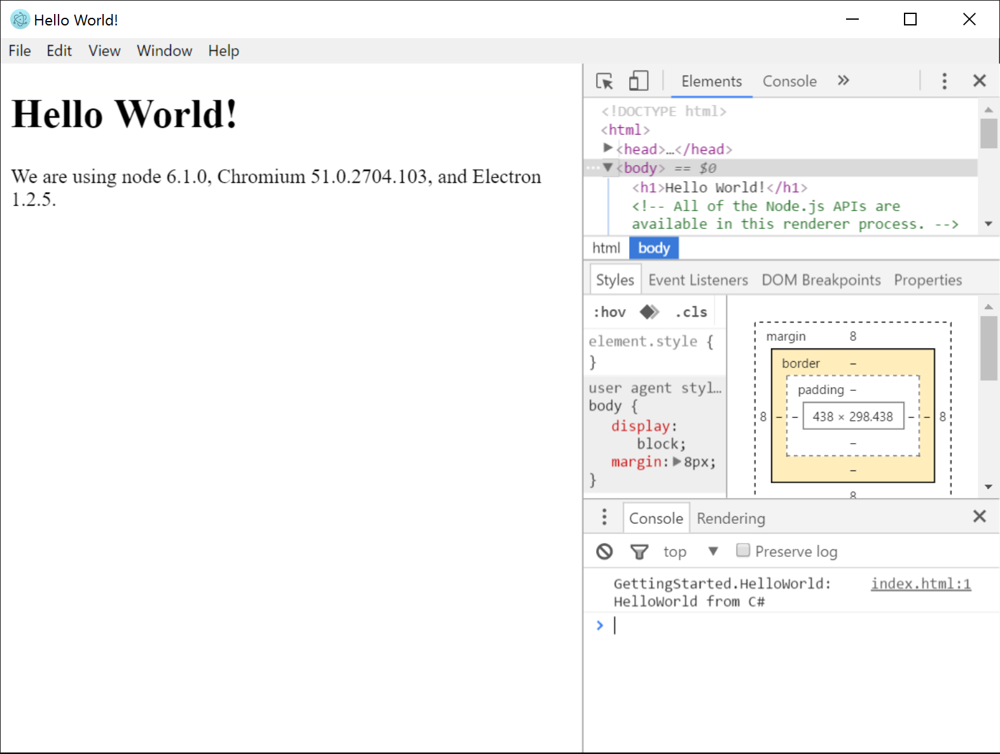

Notice
======

This workflow is just a temporary workflow while we get the effort bootstrapped, it will likely take a very
different shape in the future.   While currently this references binaries, we will be adding a source-code
mode with Roslyn, where we automatically compile the code on demand.

This is just a workflow that is being used during development.   We are open to suggestions on how to improve
this.

Getting Started
===============

Electron offers a Quick Start on their site: http://electron.atom.io/docs/tutorial/quick-start/ that explains how to get started.

Pre-requisites
---
- node.js can be found here - https://nodejs.org/
- Electron - From a command prompt ```> npm install electron-prebuilt```.  This will install the electron prebuilt which is required to run the plugins that you develop.  You can also install globally with the ```-g``` parameter. *Note on mac you may need to use ```> sudo npm install electron-prebuilt``` and enter you password when prompted and hit enter.*
- Visual Studio 2015 minimum Community edition
- Make sure the PepperPlugin has been built.  https://github.com/xamarin/WebSharp/blob/master/PepperPlugin/readme.md


Install Electron quick start
---

Clone and run the code in this tutorial by using the [xamarin/sharp-electron-quick-start](https://github.com/xamarin/sharp-electron-quick-start) repository.

Note: Running this requires [Git](https://git-scm.com/) and [Node.js](https://nodejs.org/en/download/) (which includes [npm](https://www.npmjs.com/)) on your system.

Change to directory ```WebSharp\GettingStarted>```

```shell
# Clone the repository
$ git clone https://github.com/xamarin/sharp-electron-quick-start
# Go into the repository
$ cd sharp-electron-quick-start
# Install dependencies and run the app
$ npm install && npm start
```


Building GettingStarted example
-------------------------------

Build the `GettingStarted.sln`.   You can use either Visual Studio/Xamarin Studio, or `xbuild`/`msbuild` from the command line.

Installing 'electron-dotnet' Node.js module
---

The Electron plugin is delivered as a Node.js module and needs to be installed.  *Note: We will be installing the module from a local directory for now.*

For Windows
```shell
$ cd sharp-electron-quick-start 
$ npm install ../../Tools/electron-dotnet/
```

For Mac
```shell
$ cd sharp-electron-quick-start 
$ sudo npm install ../../Tools/electron-dotnet/
```

This will install electron-dotnet as a module and allow us to do ```require('electron-dotnet').Register()``` which registers the correct PepperPlugin assembly for the platform and architecture that is used by Electron.

Embedding classes
-----------------

All the .dll assemblies we want to load will be embedded using ```<embed></embed>```.  So lets load our .Net assembly.

Open the file named ```index.html``` and scroll down to see the code for the body.  We will be embedding our plugin instance here.

Add the following code inside the ```<body>``` tag of the html.

```html
      <div id="pluginTarget" />
      <script>
        var pluginTarget = document.getElementById("pluginTarget");
        var moduleEl = require('../../Tools/electron-dotnet').Embed({
            name: 'plugin',
            id: 'plugin',
            width: 300,
            height: 200,
            src: 'GettingStarted.HelloWorld',
            path: "../bin/Debug"
        });
        pluginTarget.appendChild(moduleEl);

      </script>
```

The electron-dotnet's Embed method is a helper to create an ```<embed>``` tag that hosts a Module Instance implementation.

- height : The displayed height of the resource, in CSS pixels.
- src : The dot net class the implements the Module Instance that is embedded.
- path : The path where the assemblies can be found.
- width : The displayed width of the resource, in CSS pixels.

Now we can startup the application again with ```npm start``` and in the console you should see:

```
GettingStarted.HelloWorld: HelloWorld from C#
```


Note: On Windows
---
If there is an error about 'plugin can not be loaded' make sure that you have compiled the correct platform version (x86/x64) of the PepperPlugin that matches the Electron platform architecture that was installed above.
