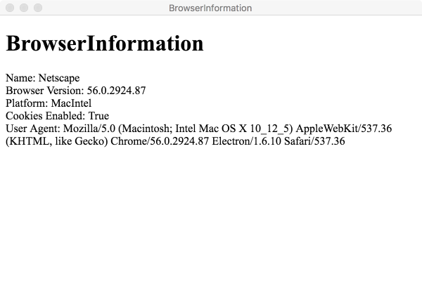

# DOM Overview

When you create a [WebSharp Electron Application](https://github.com/xamarin/WebSharp/blob/master/docs/getting-started/getting-started-websharp-electron-application.md) the `WebSharp.js.dll` assembly that is installed with `electron-dotnet` provides the bridge between `Node.js`, `Electron` and the managed code that is written.  This same assembly provides access to the HTML page's DOM elements.  A developer can take advantage of this assembly to access the DOM elements via the `WebSharpJs.Script` and `WebSharpJs.DOM` namespaces.  

Use the `GetHtmlDocument` method of the `HtmlPage` object to obtain a reference to the HTML page's Document Object Model (DOM).  Those that are familiar with `Silverlight`'s browser integration via `System.Windows.Browser` namespace should be able to get up and running fast as the API footprint is very close.

There are some differences though because of the different integration technoligies, `SilverLight` uses a plugin whereas `WebSharp` uses `Native Modules` as an interface, which affects the implementation details a little.  One of the main differences is `WebSharp`'s asynchronous only interface.

Besides the differences the developer will still work with managed objects in their code.  These objects are managed via the `WebSharp.js` assembly and can be passed back and forth between managed code and `Node.js/Electron`.

## The key classes of the WebSharpJs.DOM namespace

| Class | Description |
| --- | --- |
| HtmlPage | Represents the current HTML page.  It is the gateway to the browser's DOM via the `GetDocument` method (`HtmDocument`), which in turn allows the developer to access HTML elements (`HtmlElement`).  It also allows interacting with the browser window (`HtmlWindow` via `Electron`'s BrowserWindowProxy managed object) and obtain information about the environment the application is running within (`BrowserInformation`). | 
| BrowserInformation | Obtains name, version, and operating system of the web browser |
| HtmlDocument | Used to access the HTML DOM from managed code and represents the complete HTML Document that is loaded into the browser at the time.  Usually `HtmlElement` objects are queried for and obtained from this object. | 
| HtmlElement | Represents an HTML element in the page DOM.  There exists a full range of manipulation methods to interact with an `HtmlElement`  | 
| HtmlWindow | Represents an `Electron` window object in managed code via `Electron`'s BrowserWindowProxy.  Notice that this is not a normal `JavaScript` window as `Electron` intercepts the object and provides their own implementation.  For instance the `Prompt` method of the this object will fail as `Electron` does not provide an implementation at this time nor will they as per the documentation.   |

## HTMLPage: Gateway to DOM

Whenever you need access to the DOM the first thing you will need to do is create an `HtmlPage`.

```cs
    var page = new HtmlPage();
```

It is that simple.  From the page object you then have access to the following methods.

| Class | How To |
| --- | --- |
| HtmlDocument | var document = await page.GetDocument(); |
| HtmlWindow | var window = await page.GetWindow() |
| BrowserInformation | var info = await page.GetBrowserInformation() |

So for example we want to get the `BrowserInformation` we would have the following:

```cs
    var page = new HtmlPage();
    var info = await page.GetBrowserInformation();
   
    var infoText = $"Name: {info.Name}<br />Browser Version: {info.BrowserVersion}<br />Platform: {info.Platform}<br />Cookies Enabled: {info.CookiesEnabled}<br />User Agent: {info.UserAgent}";

    // other code following to update the DOM to display the infoText in the page.
```

* Mac


* Windows


See the [BrowserInformation source code](./browserinfo)


