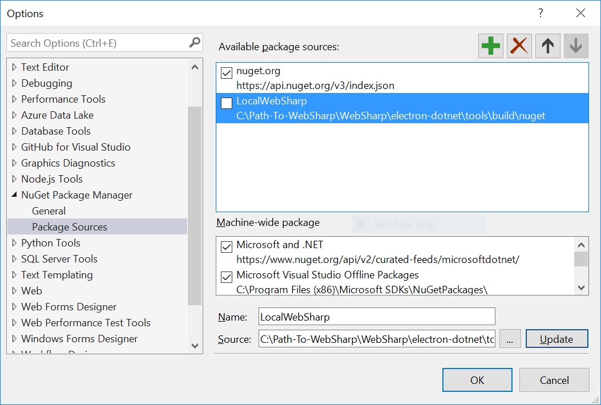
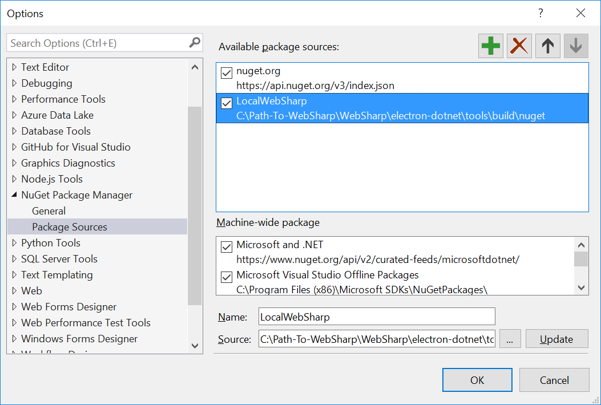
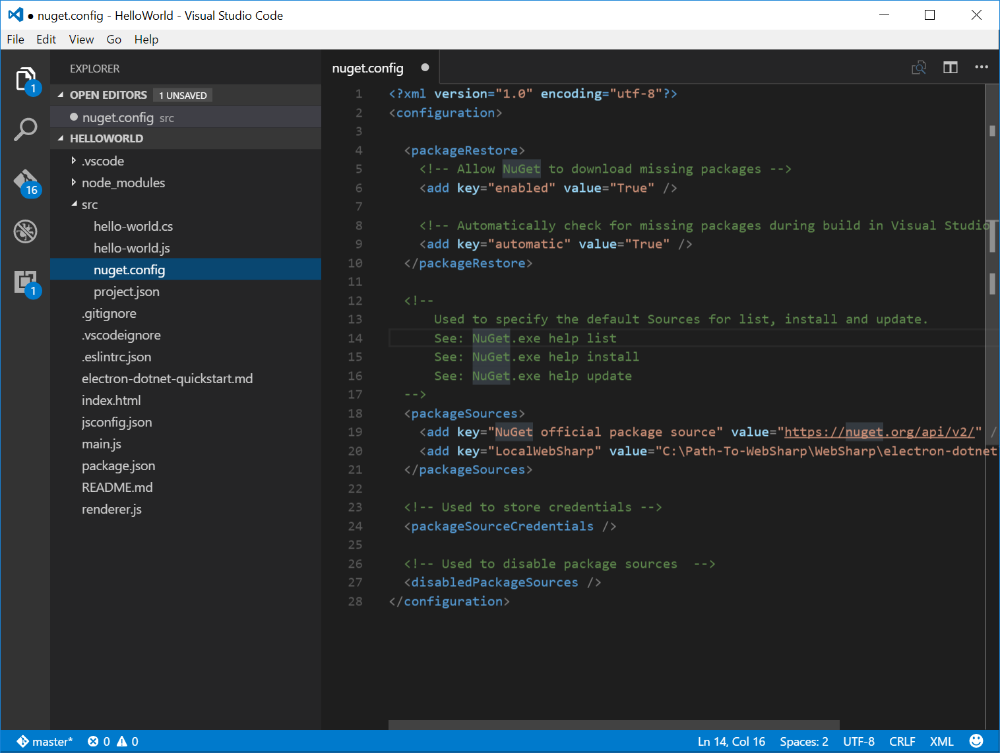

# Package Sources

You can define package sources multiple ways.

## Windows Visual Studio

The NuGet Package Manager UI allows you to easily switch between package sources using the package source selector:


To manage package sources:

1) Click on the Settings icon in the Package Manager UI outlined below or use the Tools > Options command. and scroll to NuGet Package Manager.


2) Select the Package Sources node:



3) To add a source, click the + button, edit the name, enter the URL or path in the Source control, and click Update. This will make it appear in the selector drop-down.



4) To change a package source, select it, make edits in the Name and Source boxes, and click Update.

5) To disable a package source, uncheck the box to the left of the name in the list.

6) To remove a package source, select it and click the X button.

7) Use the up and down arrow buttons to change the priority order of the package sources.

## Mac OSX Xamarin Studio


## NuGet.Config Visual Studio Code

1) In the `src` directory, create a new file named `nuget.config`.



2) Copy the following source to the newly created file:

``` json
<?xml version="1.0" encoding="utf-8"?>
<configuration>

  <packageRestore>
    <!-- Allow NuGet to download missing packages -->
    <add key="enabled" value="True" />

    <!-- Automatically check for missing packages during build in Visual Studio -->
    <add key="automatic" value="True" />
  </packageRestore>

  <!--
      Used to specify the default Sources for list, install and update.
      See: NuGet.exe help list
      See: NuGet.exe help install
      See: NuGet.exe help update
  -->
  <packageSources>
    <add key="NuGet official package source" value="https://nuget.org/api/v2/" />
    <add key="LocalWebSharp" value="Path-To-WebSharp\WebSharp\electron-dotnet\tools\build\nuget" />
  </packageSources>

  <!-- Used to store credentials -->
  <packageSourceCredentials />

  <!-- Used to disable package sources  -->
  <disabledPackageSources />
</configuration>

```

3) Change the path reference value in the `LocalWebSharp` key to point to the local directory:

``` json
<add key="LocalWebSharp" value="Path-To-WebSharp\WebSharp\electron-dotnet\tools\build\nuget" />
```

### dotnet restore nuget.config

Now when you use `dotnet restore` you can pass the config file as a parameter with `--configfile`.
``` bash
# Windows
cd src
\src> dotnet restore --configfile .\nuget.config
\src> dotnet build
\src> dotnet publish
cd ..
```

``` bash
# Mac OSX
cd src
\src$ dotnet restore --configfile ./nuget.config
\src$ dotnet build
\src$ dotnet publish
cd ..
```
  
